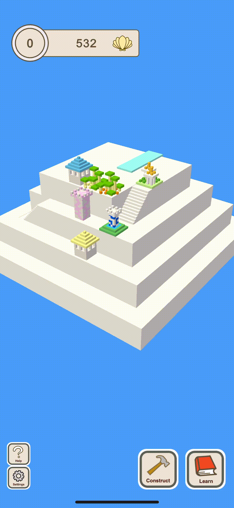
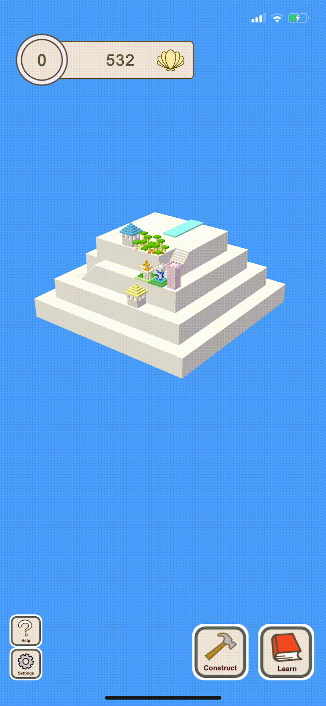
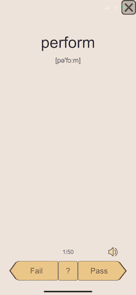

一款背单词的教育游戏

<!--more-->
## 为什么要做这个游戏
为什么人很容易沉迷游戏，而不会沉迷于工作、学习呢？因为游戏背后有一套完整的心理学理论引导你沉迷其中，包括即时反馈、阶段性目标、虚拟的游戏物品、随机的抽奖...我在想如果将游戏机制与学习结合起来，玩家可以通过在游戏中学习知识获得游戏中的奖励、经验、头衔等等，是不是也可以让人沉迷学习？基于这些想法，并且恰好新冠疫情给了我大把在家的时间，我将这个想法变成了一个手机游戏。
## 这是一个怎样的游戏
这是一个经营类的游戏，玩家通过背英语单词赚取金币，金币可以用来建造房子，开阔土地。虽然乍一看这是一个游戏，但是它实际上也是一个完善的背单词APP。作为一个曾经的托福考生，我按照我的经验将托福单词分了类，有些list是学科单词，有些list是容易弄混的词，单词的中文意思我也尽量做到简洁，这样可以让背单词更加高效。除此之外，这个APP还支持单词发音。

## 如何做这个游戏

## 下一步的计划
